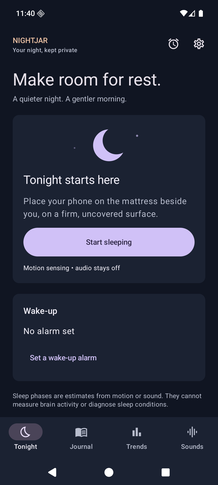
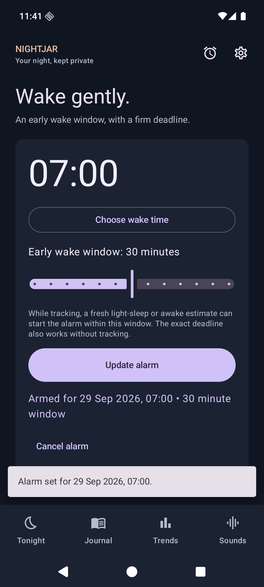
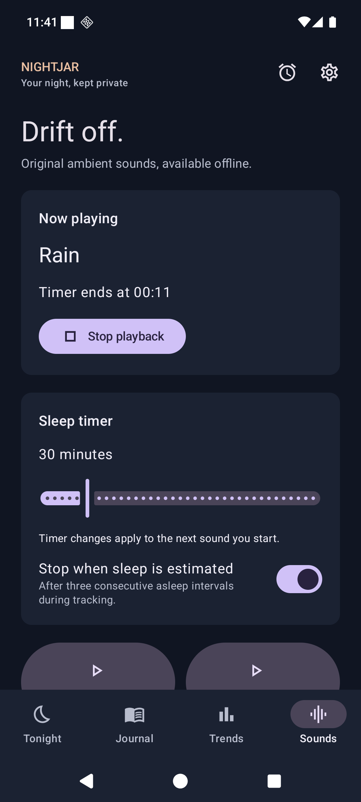

# Nightjar

**A quieter way to understand your nights and wake up on time.** Nightjar is a free, open-source Android sleep journal and smart alarm that works offline. There is no account, advertising, or cloud service.

## What Nightjar does

- **Track a night:** Use your phone's motion sensor or microphone to estimate when you were restless or still. Review a nightly report and 7- or 30-day trends.
- **Wake up your way:** Set a deadline and, if you like, an earlier window in which the alarm can ring during an estimated lighter moment. Tap a built-in alarm tune to hear a short preview before choosing it.
- **Wind down:** Play original ambient sounds on a timer or stop them when Nightjar estimates that you have fallen asleep.
- **Keep a journal:** Add notes and tags. You can optionally save short clips of possible noise events, export your data, or make a local backup.

## A look inside

<table>
  <tr>
    <td align="center"> Set an alarm and an optional early wake window</td>
    <td align="center"> Choose a sound to wind down</td>
  </tr>
</table>

## Get Nightjar

Nightjar supports Android 8.0 and newer. Signed APKs and checksums will be
available on [GitHub Releases](https://github.com/thanvirdiouf/Nightjar/releases)
after the first release is published.

## Your data stays yours

Nightjar works without internet access and has no account or cloud sync. Sleep observations remain on your device. Microphone audio is discarded unless you turn on local noise clips. You control how long those clips are kept, and deleting a night deletes its clips. Android cloud backup and device transfer are disabled for Nightjar. If you export data or create a backup, choose where to save it; exported files are not encrypted.

Motion and sound **cannot measure sleep stages**. Nightjar's awake, light, and deep labels and sleep score are estimates, not medical measurements. See [how the estimates work](ALGORITHMS.md).

Before relying on its alarm overnight, check your phone's alarm volume and battery settings and try it on your device.

## Free software

Nightjar's original code and assets are licensed under [GPL-3.0-or-later](LICENSE). You may use, study, share, and change them under that license. Third-party components retain their own licenses; see [licensing details](LICENSING.md). The [GPLv3 logo](https://commons.wikimedia.org/wiki/File:GPLv3_Logo.svg) is in the public domain.

Want to work on Nightjar? See the [development and build guide](DEVELOPMENT.md).
